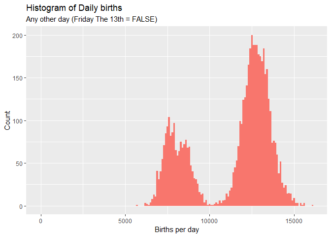

Exploratory Data Analysis
================
Talha Siddiqui

## Interesting Trends

I’m curious to know what are the least popular days to give birth.

<!-- -->

How about the most popular days to give birth?

<!-- -->

So many days in September made it to the top of the list. That’s …
interesting\!

What about the question we are really curious about – Friday The 13th?

<!-- -->

The median births support the assumption that there are fewer births on
Friday The 13th. A test would certainly show interesting findings.

The big gap between 25th quantile and median in `any other days (Friday
The 13th = FALSE)` is understandable from the least favorite days to
have a baby.

But meanwhile, let’s explore the data some more.

<!-- -->

Those two clusters in `any other days` really stand out. Lets dig a
little deeper.

<!-- -->

That’s quite a difference. What is going on here?

<!-- -->

Weekends tend to have much fewer births. This explains how roughly 30%
of our data falls in a \< 10,000 daily births cluster.

What about all 13’s only. Does Friday see a significant drop compared to
the other days?

<!-- -->

That doesn’t seem to be showing any significant drops for when 13th
falls on Friday.

We have to conduct this test now\!
